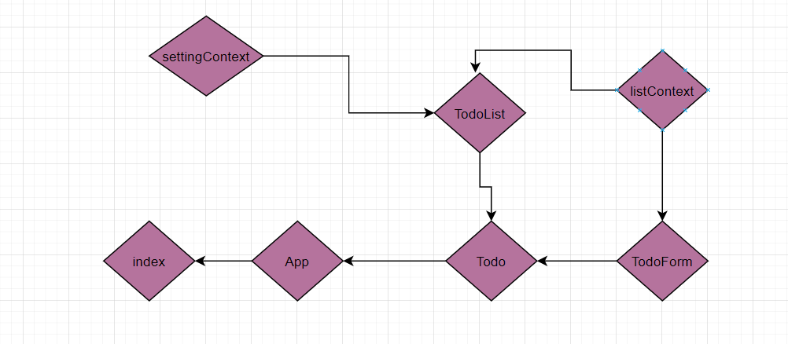

# todo-app

Incorporate configuration settings to the application.

> how a maximum of a certain number of items per screen in the List component

> Provide “next” and “previous” links to let the users navigate a long list of items

> Hide or show completed items in the list.

## sandbox Link

## PR Link

## UML

